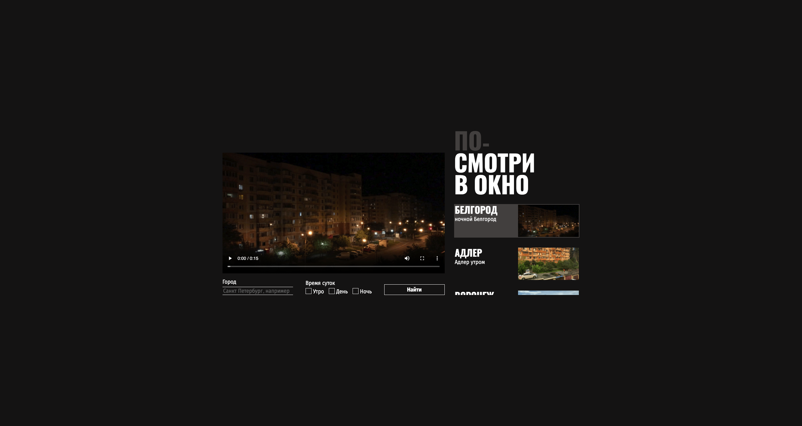

# Posmotri v okno

## Описание проекта

"Posmotri v okno" - это проект, в котором закреплялись навыки работы с CSS.

## Визуализация проекта

## Технологии

- `HTML`
- `CSS`
- `JS`

## Установка

Для запуска проекта локально необходимо:
 - Клонировать репозиторий
 - Открыть файл `index.html` в вашем браузере.
